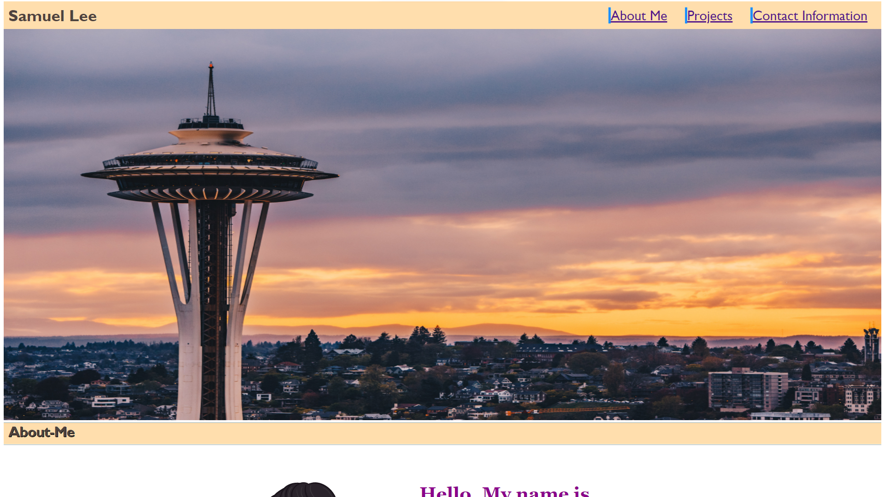

# <samuel-project-portfolio>

## Description

This is a project that utilizes HTML and CSS in order to create a mock professional coding portfolio that would be used to showcase to potential employers. It includes a header navigation bar, brief description about-me, example placeholder projects, and media responsive elements. 


Provide a short description explaining the what, why, and how of your project. Use the following questions as a guide:

- What was your motivation?
- Why did you build this project? (Note: the answer is not "Because it was a homework assignment.")
- What problem does it solve?
- What did you learn?

## Installation

This is a project that is available online via weblink. 

-https://samlee088.github.io/portfolio/

Additionally, the back-end coding is available for download through github.

## Usage

This is a project that can be used as a sample coding portfolio for applying to a junior entry level coding position. 

The use of CSS styles can be sampled on this webpage such as ‘hoover’ and ‘flex’.


Provide instructions and examples for use. Include screenshots as needed.

To add a screenshot, create an `assets/images` folder in your repository and upload your screenshot to it. Then, using the relative filepath, add it to your README using the following syntax:


   ```md
    
    ```


## Credits

List your collaborators, if any, with links to their GitHub profiles.

If you used any third-party assets that require attribution, list the creators with links to their primary web presence in this section.

If you followed tutorials, include links to those here as well.

## License

NA


